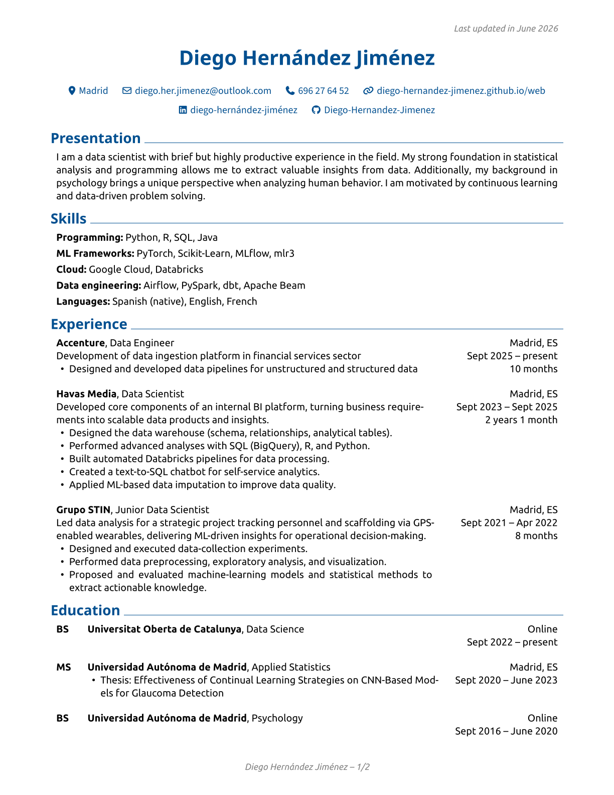
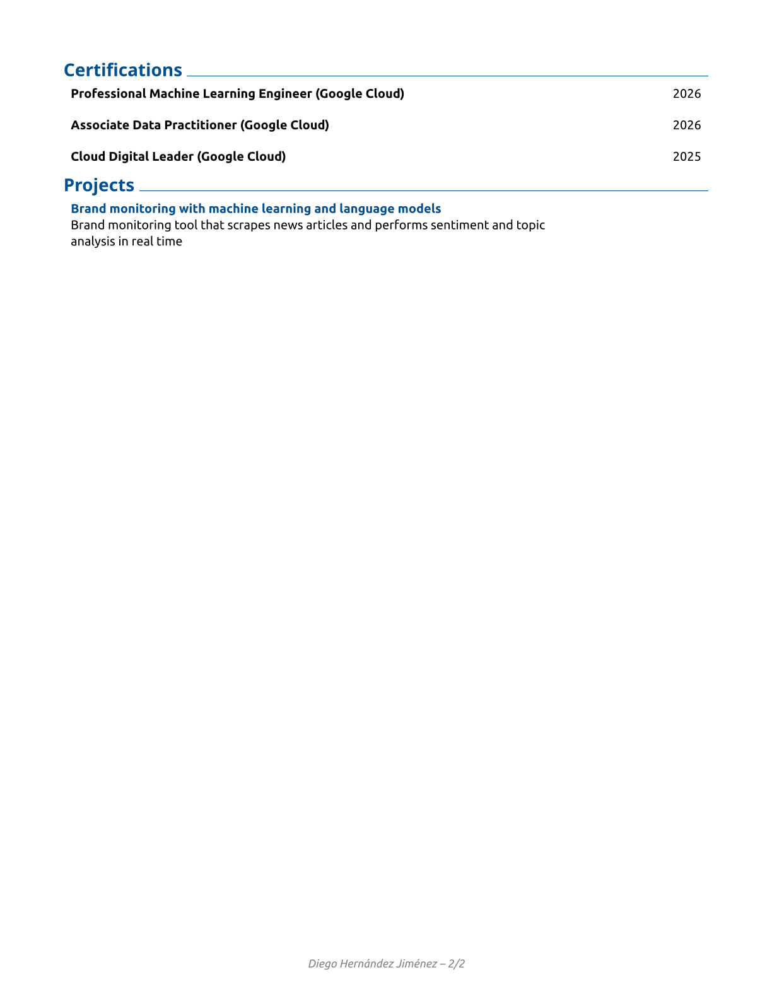

## Welcome!

In an effort to embrace the "everything-as-code" mindset, I've decided to treat my resume as an artifact of the development workflow: keeping the CV up to date. After all, a resume, more than almost anything else, should be easy to version and update. I've used [RenderCV](https://docs.rendercv.com/) for that task. No more fighting with formatting, spacing, and line breaks!

